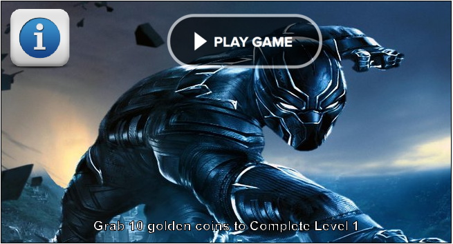
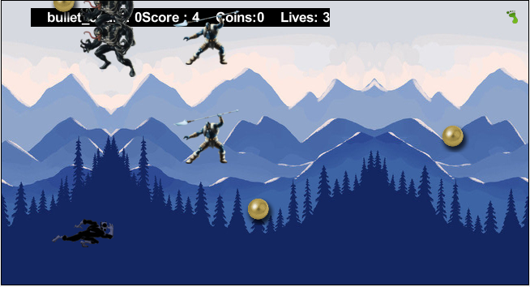
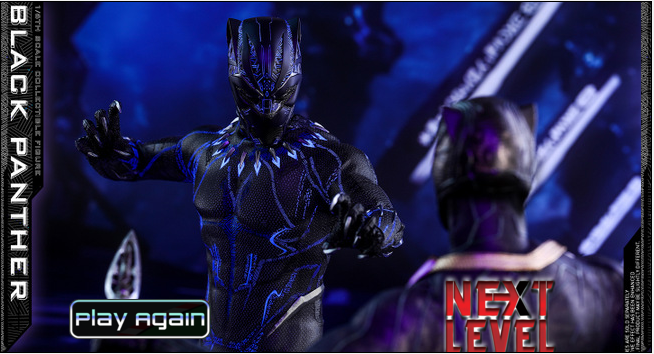
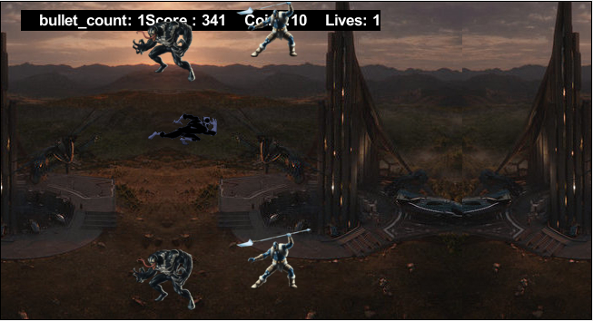
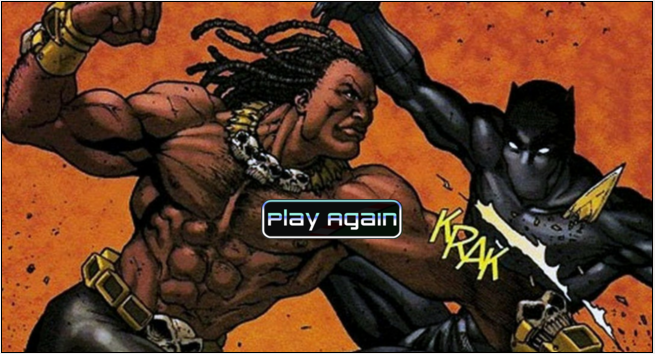
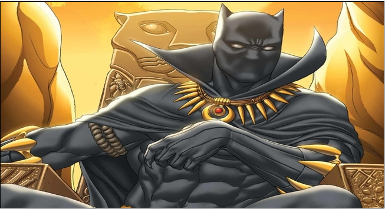

# Black Panther - CMPE 202 - Team Hackathon Project


This is the Team Hackathon Project for the CMPE 202 Software Systems Engineering course for session Spring 2018.


## Team Members:

```

1. Rajiv Yadav

2. Pradnyesh Patil

3. Gaurav Savner

4. Venkatesh Devale

5. Rohit Shrishrimal

```


### Project Idea: 
To develop a game named "Black Panther".

Theme of the game: In the city of Wakanda there lived Black Panther, the prince of Wakanda. His father was dethroned by his enemy Aries, and Black Panther was thrown out of the city. In order to win the Kingdom back he has to cross three hurdles. In the first hurdle Black Panther will have to face 2 enemies in order to obtain the powerful Weapon & his custom suit, with the weapon Black Panther can Kill Aries. Black Panther has to collect vibranium for his suit to remain charged.

## Screenshots












## Getting Started

These instructions will get you a copy of the project up and running on your local machine for development and testing purposes.

### Prerequisites

* [Java SE Development Kit](http://www.oracle.com/technetwork/java/javase/downloads/jdk8-downloads-2133151.html)

* [Greenfoot](https://www.greenfoot.org/download/files/old/Greenfoot-windows-300.msi
)
